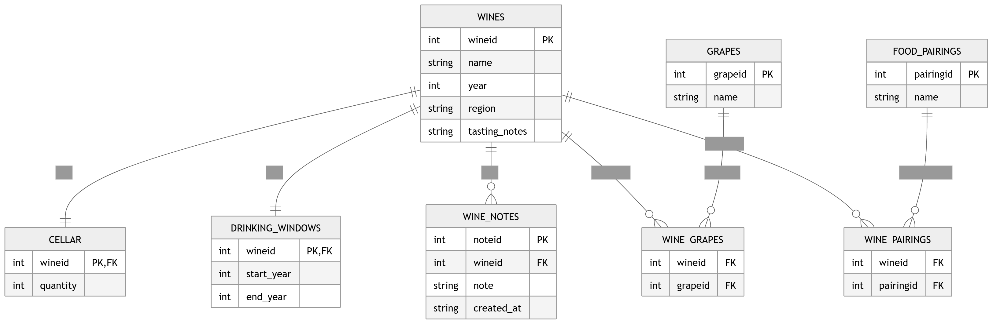

# Cellar Master

Cellar Master is a simple wine cellar app that helps you keep track of the bottles you own, discover pairings, and remember details about each wine.

It is designed to feel easy and practical, whether you are building a personal collection or just want a better way to remember wines you have tried.

## What this app does

- Save wines to a personal cellar
- Add tasting notes and food pairings
- Search your collection quickly
- Use a photo of a wine label to help identify a bottle
- Browse wines that fit a meal or occasion

## How it works

The app has a lightweight web interface where you can explore your wines and add new ones. The backend handles requests, stores wine information in a local database, and supports features such as searching, pairing suggestions, and photo-based wine recognition.

## Database schema

The app uses a small database to store wines, notes, and pairing information.

## Project structure

- backend: the server and database logic
- frontend: the web pages and user interface
- uploads: photos uploaded by the user
- pem: certificates and related files

## Getting started
1. Setup .env file
    - PEM_PATH path to pem directory
    - DB_DIR path to db.sql
    - OLLAMA_API_KEY ollama api key
2. Run generate_cert.py
3. Run dbsetup.py
4. Start the backend server from the project root.
5. Open the app in your browser.
6. Begin adding wines, notes, and pairings to your cellar.

This project is a simple web app built with a Flask backend and a lightweight front end, with data stored locally in a database.
