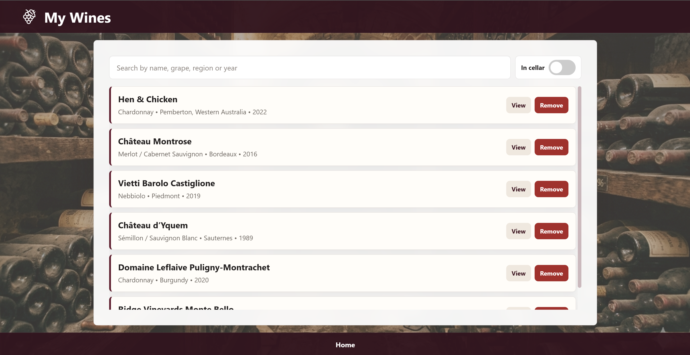
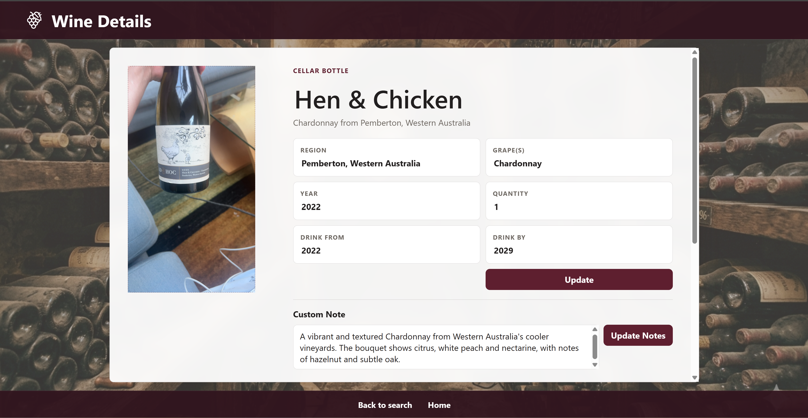
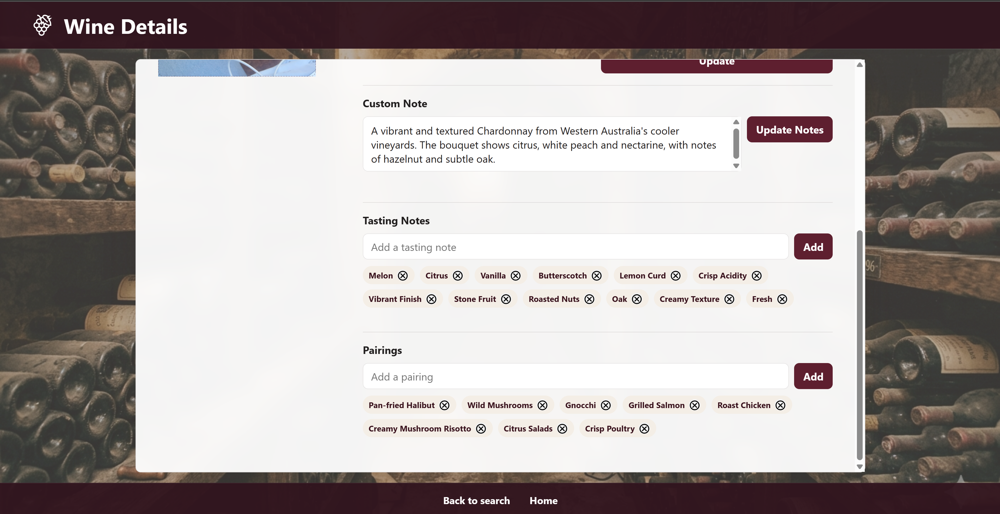
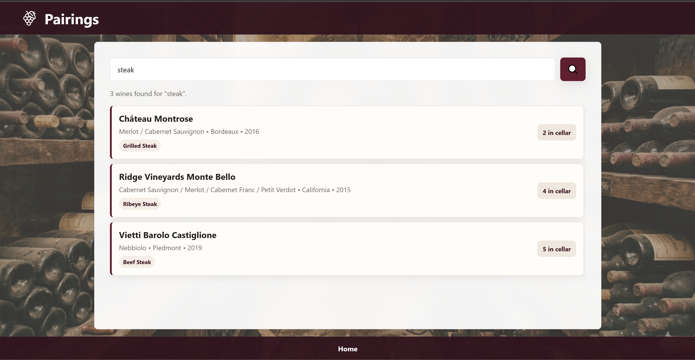

# Cellar Master

CellarMaster is a wine cellar tracking app that makes it easy to keep track of the bottles you own, discover pairings, and store details about each wine. The app automatically extracts tasting notes, food pairing ideas and optimal drinking windows.

It is designed to feel easy and practical, whether you are building a personal collection or just want a better way to remember wines you have tried.

## What this app does

- Save wines to a personal cellar
- Automatically adds tasting notes and food pairings
- Search your collection quickly
- Use a photo of a wine label to identify a bottle
- Browse wines that fit a meal or occasion

## Usage

- Open the web app in your browser
- Select 'Add or Remove wine'
- Take a photo of a bottle
- Verify the extracted details are correct
- Select 'add' to add to wine cellar or 'remove' to remove from wine cellar

## Database schema

The app uses a database to store wines, notes, and pairing information.

## Project structure

- backend: the server and database logic
- frontend: the web pages and user interface
- uploads: photos uploaded by the user
- pem: certificates and related files

## Getting started
1. Setup .env file
    - PEM_PATH path to pem directory
    - DB_DIR path to db.sql
    - OLLAMA_API_KEY ollama api key
2. Run generate_cert.py
3. Run dbsetup.py
4. Start the backend server from the project root.
5. Open the app in your browser.
6. Begin adding wines, notes, and pairings to your cellar.

# Below are some screenshots of the web app

